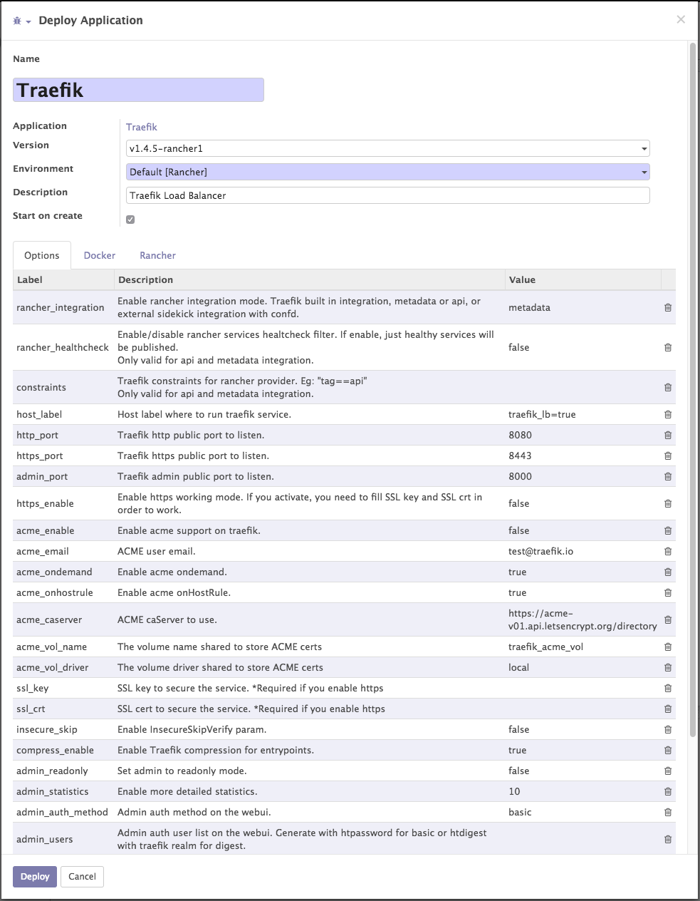

.. image:: https://img.shields.io/badge/licence-AGPL--3-blue.svg
   :target: https://www.gnu.org/licenses/agpl
   :alt: License: AGPL-3

=================
Rancher Connector
=================

This module allows for you to synchronize Odoo and Rancher.

This is a beta module, and we do not recommend that you use it in production.

+---------------------+--------+--------+--------+
| Object              | Import | Export | Delete |
+=====================+========+========+========+
| Environment         | Yes    | No     | No     |
+---------------------+--------+--------+--------+
| Host                | Yes    | No     | No     |
+---------------------+--------+--------+--------+
| Stack               | Yes    | Yes    | Yes    |
+---------------------+--------+--------+--------+
| Service             | Yes    | No     | No     |
+---------------------+--------+--------+--------+
| Container           | Yes    | No     | No     |
+---------------------+--------+--------+--------+
| Catalog Templates   | Yes    | No     | No     |
+---------------------+--------+--------+--------+

Installation
============

To install this module, you need to:

#. Install ``gdapi-python`` using your preferred Python package management method
#. Download `connector <https://github.com/OCA/connector/tree/10.0/>`_ and its
   dependencies to your Odoo addons path.
#. Follow `queue_job <https://github.com/OCA/queue/tree/10.0/queue_job#installation>`_
   install instructions.
#.  Install this module (``connector_rancher``).
#. Deploy a Docker/Rancher secret containing the ``secret_key`` that will be used
   to access Rancher. You can also simply create a file somewhere containing the
   key.

Configuration
=============

To configure this module, you need to:

#. Go to Connectors => [Rancher] Backends
#. Create a new backend. The file path for the secret that was created in the
   ``Installation`` section should go in ``Secret Path``.
#. Restart Odoo. This is a required step for the asynchronous queue, and can be
   done at any time after install. If you're missing data and haven't restarted,
   this is the problem.

Usage
=====

Rancher data can be seen in the ``Infrastructure`` application menus.

For the most part, everything is read-only.

Deploy Applications
-------------------

Rancher is still the recommended way of deploying applications, but it is still
possible to deploy them from Odoo as well. The primary purpose for this workflow
is to allow for a developer to create stacks based on actions within Odoo.

You can deploy an application stack using Rancher catalog entries by going to
the ``Applications`` Menu in the ``Infrastructure`` app. Find an application you
want to deploy, then use the ``Deploy Application`` link in the action menu to show
the deployment wizard:

Fill the options out as you typically would in Rancher. The Docker and Rancher
compose files are also exposed on their respective tabs - should you feel the need
to edit those manually.

Click ``Deploy`` and your stack will provision in Rancher.

Known Issues
============

* Data imports are quite dumb and should be optimized to reduce duplications.
* Due to above dumbness, data imports aren't happening as often as they should.
* Selection options should be represented in application deployer, instead of plain
  text.

Road Map
========

Bug Tracker
===========

Bugs are tracked on `GitHub Issues
<https://github.com/LasLabs/odoo-connector-rancher/issues>`_. In case of trouble, please
check there if your issue has already been reported. If you spotted it first,
help us smash it by providing detailed and welcomed feedback.

Credits
=======

Contributors
------------

* Dave Lasley <dave@laslabs.com>

Do not contact contributors directly about support or help with technical issues.

Maintainer
----------

.. image:: https://laslabs.com/logo.png
   :alt: LasLabs Inc.
   :target: https://laslabs.com

This module is maintained by LasLabs Inc.
